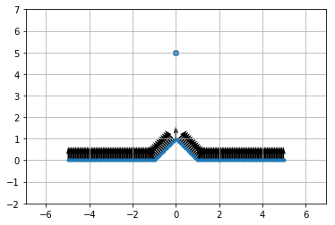
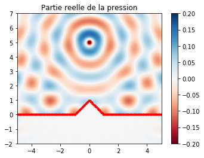
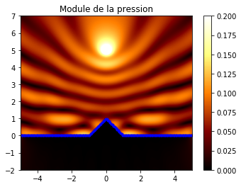

# Modélisation de la réflexion d'une onde à une interface rugueuse

## Présentation

On utilise la méthode des éléments finis de frontière pour résoudre l'équation de Helmholtz sur un domaine. Le script *RIS* a été créé dans ce but.

## Installation
Pour commencer à utiliser ce script, il suffit de cloner ce dépôt, et de lancer le script *"install.sh"*. Ce script installera les dépendances nécessaires au bon fonctionnement du programme, c'est à dire:
- Numpy
- Scipy
- Matplotlib
- Jupyter
- gfortran

## Utilisation
On commence par importer la librarie:


```python
import rough_interface as ri
```

On crée un objet **problem** qui va servir de base à la suite:


```python
problem = ri.RoughInterfaceScattering()
```

On définit les paramètres du problème:


```python
problem.create_interface('s_unique',1,1,150,5)
problem.set_source('ponctuelle',[0,5])
problem.set_frequency(200)
problem.set_omega([-5,5,-2,7],150,.2)
problem.set_circle(2,[0,0])
```

(Le but de chacune de ces lignes est défini dans le fichier *_ _init_ _.py* )
## Démarrage de la simulation


```python
pression, directivite = problem.start()
```

    Simulation de la réflexion d'une onde ponctuelle à une interface rugueuse.
    8 processeur(s) utilisé(s)
    Représentation de la configuration





    0.0336980819702s
    1.49272179604s







